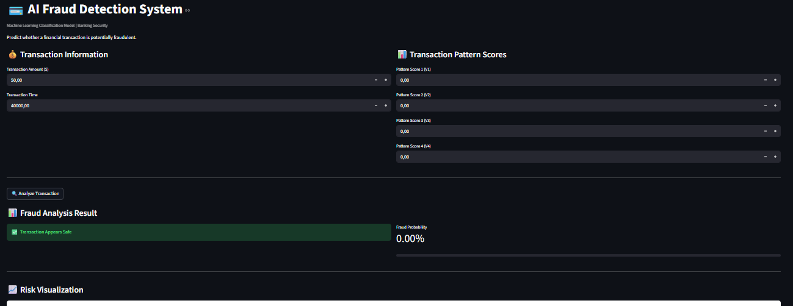
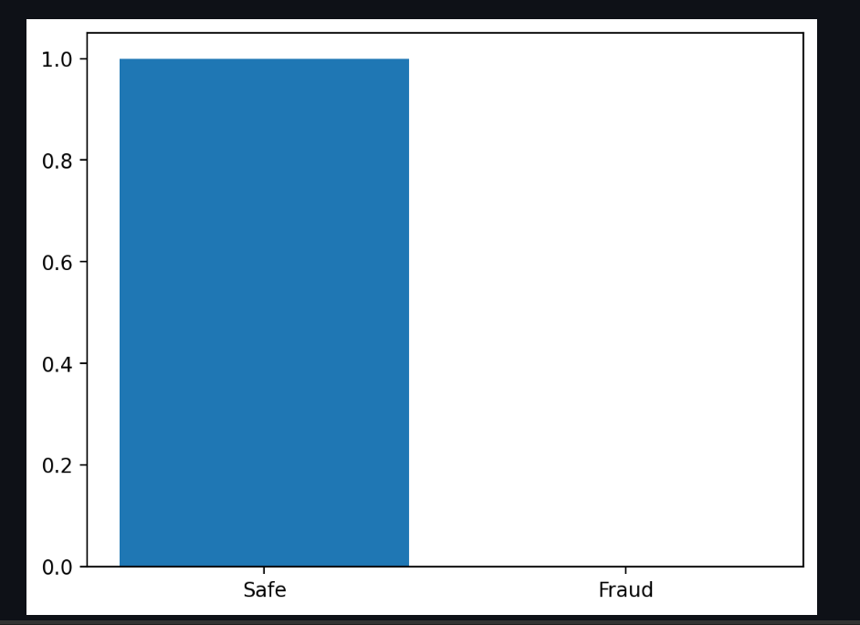
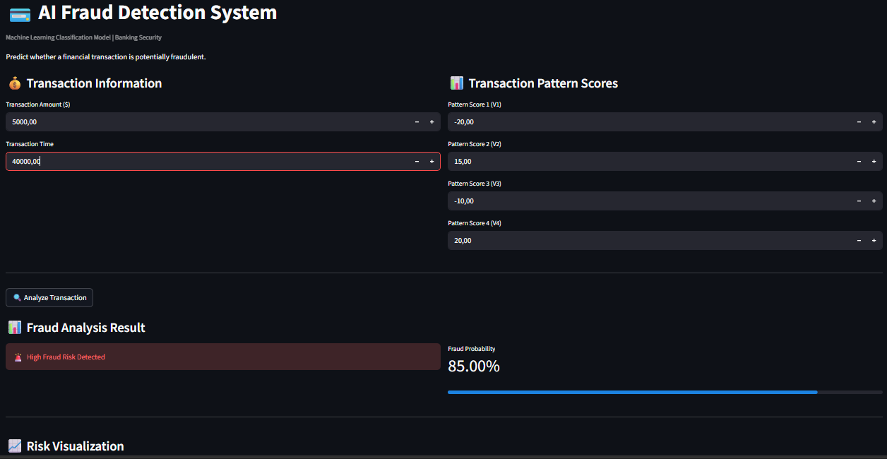
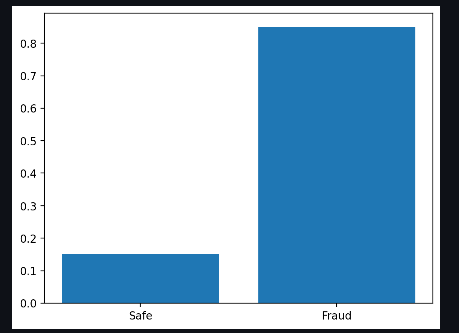

# FRAUD DETECTION SYSTEM 

This is a machine learning web application that detects fraudulent financial transactions using a trained Random Forest classification model. Built with Python and Streamlit and deployed as an interactive dashboard.

------------------------------------------

LIVE DEMO
https://your-streamlit-app-link-here

------------------------------------------

PROJECT OVERVIEW

This projects main goal or aim is to detect potentially fraudulent transactions based on transaction patterns and behavior signals.

The model analyzes transaction features and outputs:
- Fraud probability
- Risk classification (Safe or Fraud)
- Visual risk interpretation

------------------------------------------

MACHINE LEARNING MODEL

- Algorithm: Random Forest Classifier
- Problem Type: Binary Classification
- Target Variable: Fraud (0 = Safe, 1 = Fraud)
- Handles class imbalance using class weighting

------------------------------------------

DATASET 

This project uses the Kaggle Credit Card Fraud Detection dataset:

👉 https://www.kaggle.com/datasets/mlg-ulb/creditcardfraud

- Contains anonymized transaction features (V1–V28)
- Highly imbalanced dataset
- Real-world fraud detection scenario

------------------------------------------

FEATURES

- Real-time fraud prediction
- Fraud probability scoring
- Risk visualization charts
- Interactive Streamlit dashboard
- Simple and clean UI
- Model trained on real-world dataset

------------------------------------------

TECH STACK

- Python
- Streamlit
- Pandas
- NumPy
- Scikit-learn
- Matplotlib
- Joblib

------------------------------------------

PROJECT STRUCTURE
fraud-detection-system/
│
├── app/
│ └── app.py
│
├── data/
│ └── creditcard.csv (not included in repo)
│
├── models/
│ ├── model.pkl
│ └── features.pkl
│
├── screenshots/
│ ├── Home.png
│ ├── SafeTransaction.png
│ ├── SafeTransactionchart.png
│ ├── FraudDetected.png
│ └── FraudDetectedchart.png
│
├── train_model.py
├── requirements.txt
└── README.md

------------------------------------------

SCREENSHOTS
### 🏠 Home Screen

### ✅ Safe Transaction Prediction

### 🚨 Fraud Detection Result

------------------------------------------

BUSINESS IMPACT

- Helps detect fraudulent transactions early
- Reduces financial losses
- Supports real-time decision making
- Demonstrates AI in cybersecurity & fintech

------------------------------------------

AUTHOR
**Craig D Chiambiro**

Aspiring Software Engineer / Data Science Enthusiast  
Focused on Machine Learning, AI Systems, and Full Stack Development

------------------------------------------

FUTURE IMPROVEMENTS

- Add deep learning model comparison
- Improve UI with advanced dashboards
- Add email alert system for fraud detection
- Deploy API version using FastAPI
- Add SHAP explainability for model interpretation

------------------------------------------

IF Y0U LIKE THIS PR0JECT

Please give it a ⭐ on GitHub and feel free to connect on linkedin - Craig Chiambiro